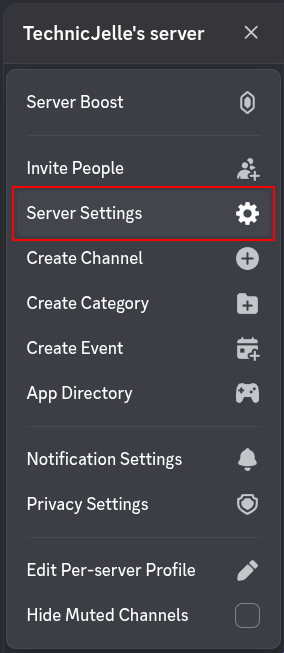
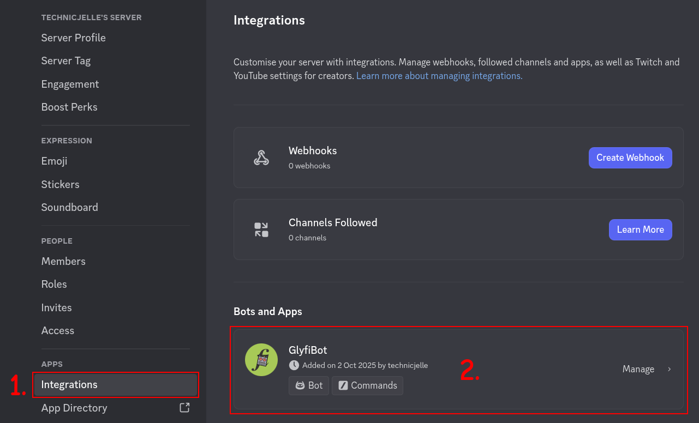
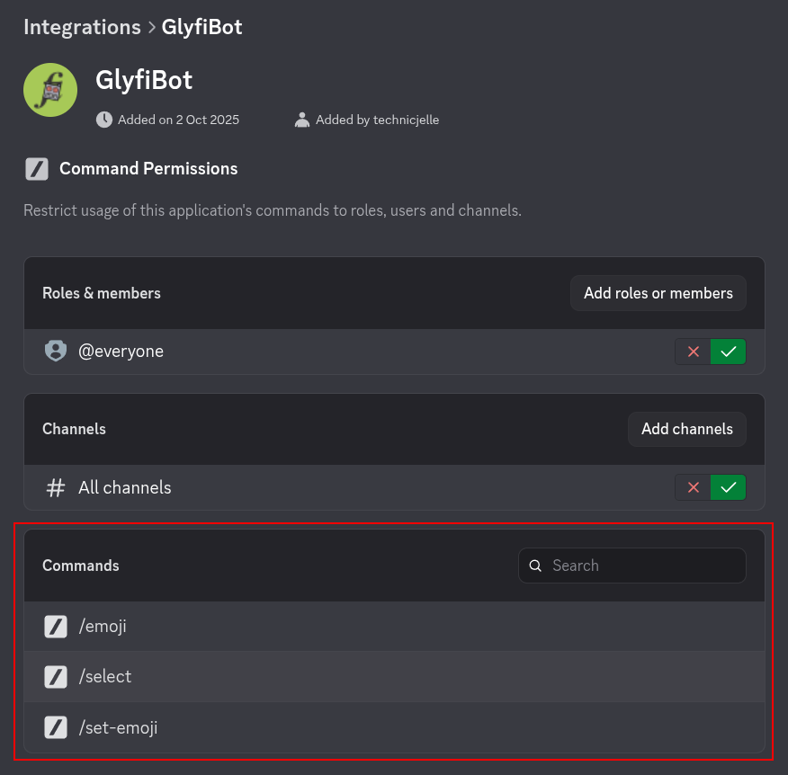
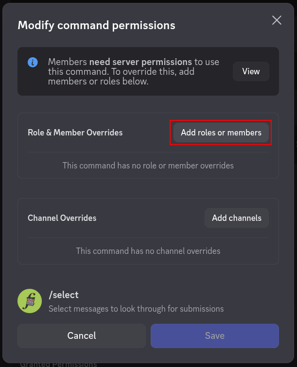
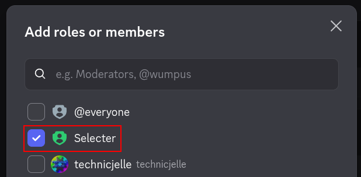

# Glyfi Bot

Discord bot for the Glyphs & Alphabets server.

The goal of this project is to encourage very collaborative development on this bot.

## Current functionality:

- `/emoji`: See the currently set emoji that marks something as a submission.
  - By default, anyone can run this.
- `/select`: Provide the IDs of two messages in the channel between where to look for submissions.  
  Submissions will be collected and provided in one message, for extra easy downloading!
  - By default, only Administrators can run this.
- `/set-emoji`: Set the emoji that will mark something as a submission.
  - By default, only Administrators can run this.

To allow a specific role to run these commands instead of just Administrators,
go to your **Server Settings** > **APPS: Integrations** > **GlyfiBot: Manage**.  
In here, choose each the command you wish to assign a role to, and then click **Add roles or members**.

Command Permissions Screenshots Walkthrough

## Running

1. Create a new Bot in the Discord Developer Panel
2. Download a build from [GitHub Actions](https://github.com/glyphs-fi/GlyfiBot/actions/workflows/build.yml) **OR** Clone this repository and build it
3. Set the `GLYFI_TOKEN` environment variable to your token
4. Run it

## Tech Stack

For the Programming Language, I chose [C#](https://dotnet.microsoft.com/en-us/languages/csharp), because it is relatively accessible for any programmer.

For the Discord Library, I chose [Netcord](https://github.com/NetCordDev/NetCord), because it looked pretty good.
