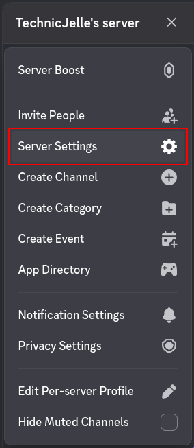
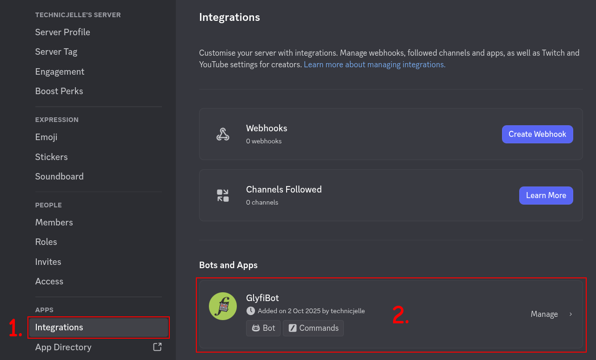
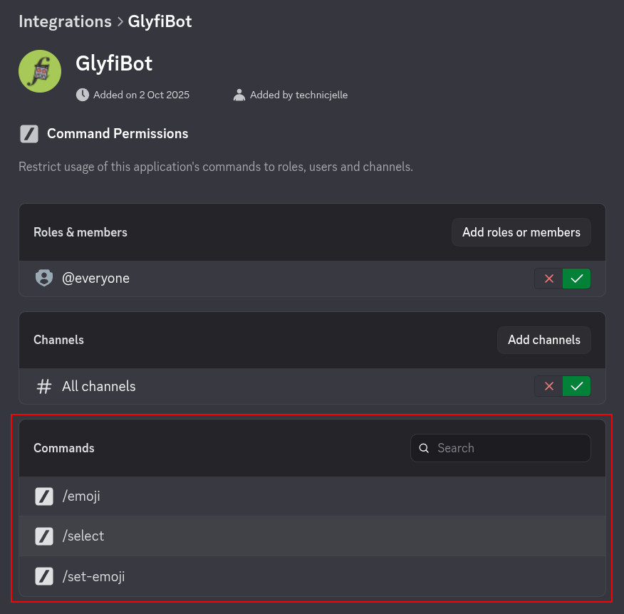
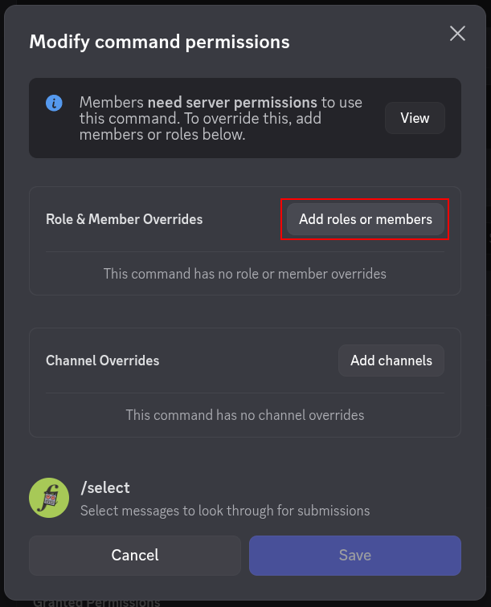
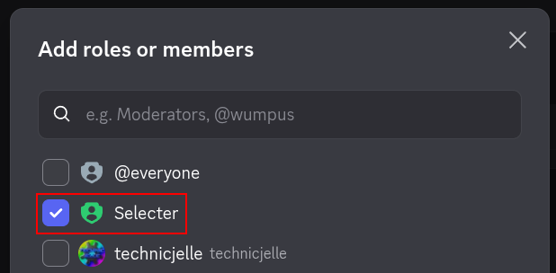

# Glyfi Bot

Discord bot for the Glyphs & Alphabets server.

The goal of this project is to encourage very collaborative development on this bot.

## Current functionality:

- `/emoji`: See which emoji marks something as a submission in this channel.
  - By default, anyone can run this.

- `/set-emoji`: Set the emoji for this channel that will mark something as a submission.
  - Leave empty to remove the emoji for this channel.
  - By default, only Administrators can run this.

- `/typst announcement`: Generates an announcement image with our Typst script.
  - `challenge_type`: Which challenge this image is for.
  - `input`: The "content" of the challenge; the glyph for the Glyph Challenge, and the ambigram for the Ambigram
    Challenge.
  - `current_week`: The week number to generate this image for. (Last week plus one)
  - `start_date`: (Optional) The start date of this challenge. (Format: `YYYY-MM-DD`)
  - `end_date`: (Optional) The end date of this challenge. (Format: `YYYY-MM-DD`)
  - `output_format`: (Optional) Whether the output as PNG, PDF, or both. Generates both by default.
  - `ppi`: (Optional) The PPI of the generated PNG. Uses Typst's own 144 by default.
  - By default, only Administrators can run this.

- `/typst showcase`: Generates a showcase image with our Typst script.
  - `challenge_type`: Which challenge this image is for.
  - `input`: The "content" of the challenge; the glyph for the Glyph Challenge, and the ambigram for the Ambigram
    Challenge.
  - `current_week`: The week number to generate this image for. (Last week plus one)
  - `start`: The Message ID of the message from where to start looking for submissions.  
    Only messages that have been reacted to with the emoji set with `/set-emoji` by their authors will be counted.
  - `end`: (Optional) The Message ID of the message from where to stop looking for submissions.
    Will look until "now" by default.
  - `start_date`: (Optional) The start date of this challenge. (Format: `YYYY-MM-DD`)
  - `end_date`: (Optional) The end date of this challenge. (Format: `YYYY-MM-DD`)
  - `output_format`: (Optional) Whether the output as PNG, PDF, or both. Generates both by default.
  - `ppi`: (Optional) The PPI of the generated PNG. Uses Typst's own 144 by default.
  - By default, only Administrators can run this.

- `/typst winners`: Generates a winners image with our Typst script.
  - `challenge_type`: Which challenge this image is for.
  - `current_week`: The week number to generate this image for. (Last week plus one)
  - `first_place`: The Message ID of the winning submission.
  - `second_place`: (Optional) The Message ID of the second place submission.
  - `third_place`: (Optional) The Message ID of the third place submission.
  - `first_place_name_override`: (Optional) If the automatically collected username does not look good, you can override
    it with this option.
  - `second_place_name_override`: (Optional) ↑ditto
  - `third_place_name_override`: (Optional) ↑ditto
  - `output_format`: (Optional) Whether the output as PNG, PDF, or both. Generates both by default.
  - `ppi`: (Optional) The PPI of the generated PNG. Uses Typst's own 144 by default.
  - By default, only Administrators can run this.

- `/sticky`: Sets a sticky message for this channel. This message will always be visible at the bottom of the channel.
  - Leave empty to remove the sticky message for this channel.
  - By default, only Administrators can run this.

- `/pfps`: Get the profile pictures of one or multiple users in bulk.
  - By default, only Administrators can run this.
 

- `/select`: Provide the IDs of two messages in the channel between where to look for submissions.  
  Submissions will be collected and provided in one message, for extra easy downloading!
  - Only messages that have been reacted to with the emoji set with `/set-emoji` by their authors will be counted.
  - By default, only Administrators can run this.

## Command Permissions

To allow a specific role to run these commands instead of just Administrators,
go to your **Server Settings** > **APPS: Integrations** > **GlyfiBot: Manage**.  
In here, choose each the command you wish to assign a role to, and then click **Add roles or members**.

Click to see these steps in screenshots

## Running

1. Create a new Bot in the Discord Developer Panel (You can follow the **Step 1** from [here](https://netcord.dev/guides/getting-started/making-a-bot.html))
2. Download a build from [GitHub Actions](https://github.com/glyphs-fi/GlyfiBot/actions/workflows/build.yml?query=branch%3Amain) **OR** Clone this repository and build it
3. Optionally set the token with the `GLYFI_TOKEN` environment variable.  
   If you do not do this, the bot will ask you to paste in the key, which it will then store in its data folder for the subsequent runs.
4. Run the bot executable (double-click or `$ ./GlyfiBot`)

## Tech Stack

For the Programming Language, I chose [C#](https://dotnet.microsoft.com/en-us/languages/csharp), because it is
relatively accessible for any programmer.

For the Discord Library, I chose [Netcord](https://github.com/NetCordDev/NetCord), because it looked pretty good.
